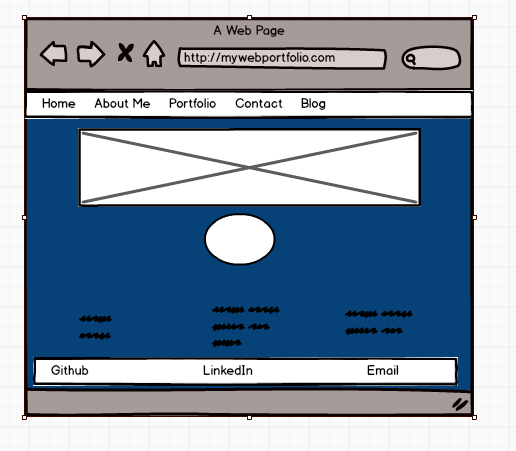
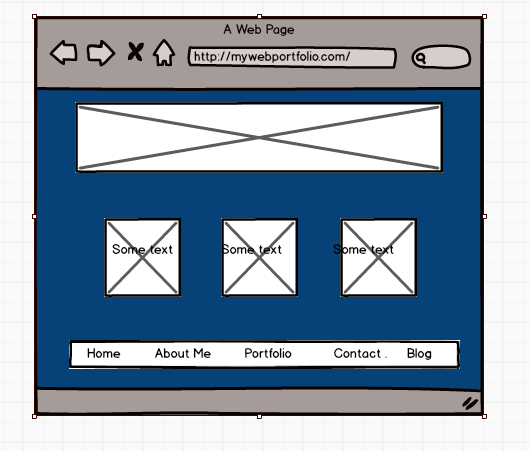
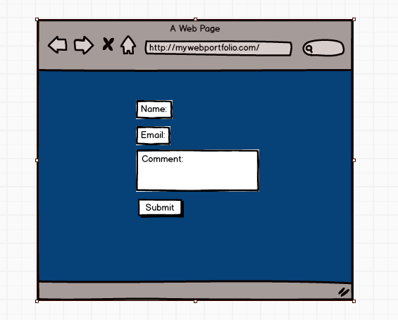
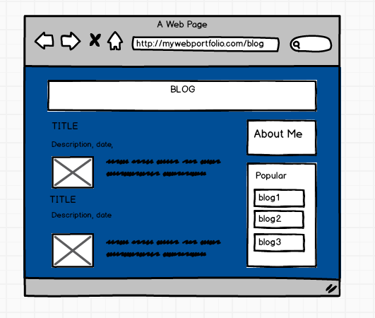
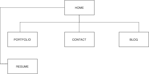

#### Link to website: 
Netlify - I was having trouble logging in to my netlify account. Couldn't resolve the issue before the deadline.
Github - https://github.com/augam8/portfolio

### DESCRIPTION:

This portfolio was designed to provide the user (target audience) a means to know more about me, my skills and most importantly to be able to contact me. This portfolio showcases and summarises all the things I have done during my course at Coder Academy. This personal website also highlights my coding abilities and design style as an inspiring full stack developer. 

This portfolio website is best viewable in desktop mode using Chrome browser. It may not look good in other browsers and devices.
### TARGET AUDIENCE: 

The intended audience for this website includes: potential employers, recruiters, clients as well as other developers and designers. 

### FUNCTIONALITY AND FEATURES:
Here are list of features and functionality of my portfolio website;
•	navigation bar at top right side. Users can click each text and it will load to that page
•	Hover effects added to text on navigation bar. When mouse is placed on the text it will highlight the word. This lets the user know you are navigating that page when clicked on the text.
•	About me has a resume link which can be viewed and downloaded
•	Portfolio page displays a screen shot of projects that have been done.
•	Has a blog page
•	Contact page have built in form to be able to contact me
•	Footer has social icons and quick links back to each page
•	Legalities – copyright at bottom of page
•	Responsive to three screen sizes (Desktop, Tablet, Mobile) – unable to do
•	List and screenshot of projects and GitHub repositories
•	Two different variations of the website

### COMPONENTS:

Navbar – This is located on top of the page on the right side. Users will let them know which page they are on if they point the mouse to the text word. It is a simple navbar that can be defined on top of the page. The navbar has a hover effect on the text words. If user hovers over them the background chages colour to dark to let them know they will be on that page if clicked on. 

Footer – The footer have two sections, it has quicklinks much like a navbar which be clicked to go to that page. This section also has social icons which are links external pages to my other digital channels. Footer is also nested in a flexbox.

Images – The images in portfolio section is in the main content of this page using a flex box and grid.

Contact – The contact page has a form layout where user can reach me if they input all the required field on the text input and by clicking submit button. 
•	

### Tech Stack:
•	HTML
•	CSS
•	Github
•	Netlify

### WIREFRAMES:
After browsing through many inspirations from various sites. I decided to stick with a minimalistic design and theme. I used a software called balsamic mockups 3 to create my wireframe. Refer to screenshot mockup;
  
	

	

  

					

### ACCESSIBILITY:
This website includes alt text on all images to ensure compatibility with screen readers for visually impared users. I was careful not to use high contrast colour palette.

### CONSIDERATIONS: 
There were no serious threat and ethical considerations as this project is published as open source. It is important that my web folio is accessible to anyone. I didn’t have to show my email on my site, so the contact form is really great concealing that. Using Netlify and SRI made it 
### DESIGN VARIATIONS:
There are three variations to the overall design of my website which have been deployed in my github account and can be accessed in the below links.
Githublink v1 – change-background
Github link v2 – change-font-color

### KEY CHALLENGES:
Everything was difficult, given that we have only learnt html and css in such a short  period of time and then deploy this project, it was a nightmare. There were lots of experimentation and trial and error, I watched a lot of tutorials and I tried to just replicate those. (Credits given below)  It was very tricky to get everything aligned.
The website is stil not yet fully esponsive so it may not look good in other browsers and devices because I ran out of time for this.
I would have love to experiment more with colour schemes, fonts and responsive layouts for different devices due to time constraint. The good thing now is as I learn more I can update my page and have it fully functioning with lots of different styling that I can articulate to potential clients or employers.
### SITEMAP:
My portfolio website consists of 4 pages, navigatable from the navbar or by scrolling.
Home: About Me – Short biography
Portfolio – My projects and services
Contact – Form to get in touch with me
Blog – Blog about anything

 

##### Credits:
Youtube: html and css tutorials
•	Computer conversation
•	All type tuturials
•	Kevin Powell
•	Coding Journey
•	Web Dev Simplified

Facebook page groups:
•	HTML and CSS
•	All Programming language

Google:
•	Icanbuildablog.com
•	W3schools.com
•	Portfolio sites
•	pinterest
